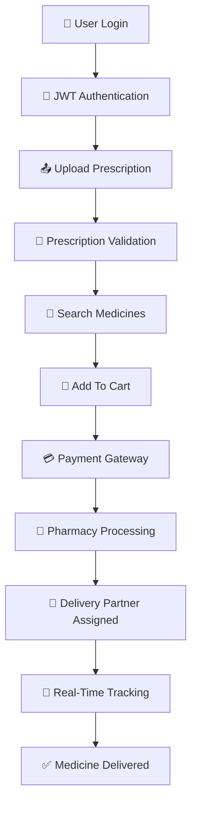
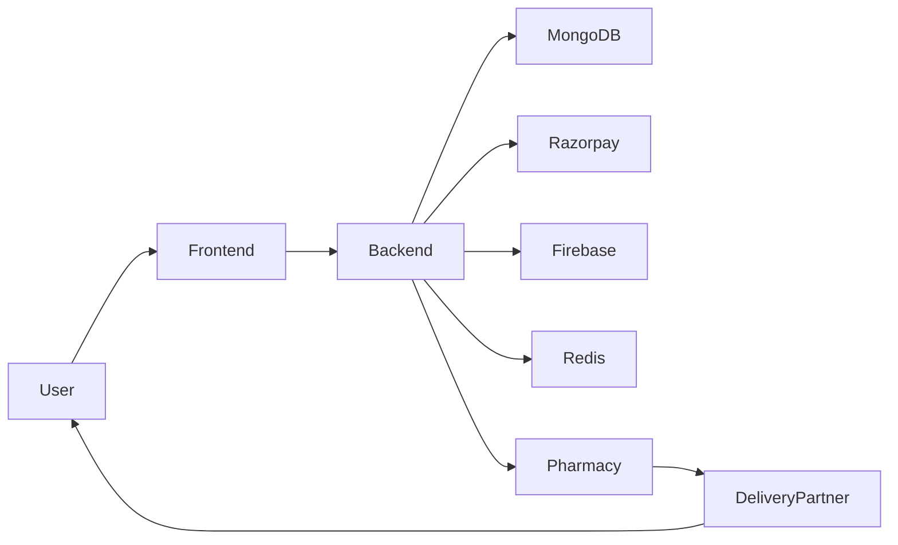

# 🚑💊 MedSwift — AI Powered Smart Medicine Delivery Platform

<p align="center">


</p>

---

<p align="center">


</p>

---

<p align="center">


</p>

---

# ✨ Overview

MedSwift is a next-generation AI-powered medicine delivery ecosystem designed to connect patients, pharmacies, and delivery partners through a unified digital platform.

The system enables users to upload prescriptions, order medicines, track deliveries in real time, and receive intelligent medicine recommendations while helping pharmacies manage inventory efficiently.

Built using the **MERN Stack**, MedSwift transforms traditional medicine procurement into a fast, secure, and technology-driven experience.

---

# 🚀 Core Features

# 👨‍⚕️ Patient Features

✅ Secure User Registration & Login

✅ Prescription Upload & Verification

✅ Search Medicines Instantly

✅ AI-Based Medicine Suggestions

✅ Alternative Medicine Recommendations

✅ Real-Time Order Tracking

✅ Razorpay / UPI Payment Integration

✅ Order History Management

✅ Responsive Mobile-Friendly Interface

---

# 🏥 Pharmacy Features

✅ Pharmacy Dashboard

✅ Medicine Inventory Management

✅ Prescription Verification

✅ Order Processing System

✅ Sales Analytics

✅ Low Stock Alerts

✅ Order Status Updates

✅ Revenue Monitoring

---

# 🚴 Delivery Partner Features

✅ Delivery Partner Authentication

✅ Smart Order Assignment

✅ Live GPS Navigation

✅ Route Optimization

✅ Dynamic ETA Calculation

✅ Delivery Status Updates

✅ Earnings Dashboard

---

# 🛠️ Admin Features

✅ Secure Admin Authentication

✅ Pharmacy Management

✅ User Management

✅ Delivery Partner Management

✅ Inventory Monitoring

✅ Order Monitoring Dashboard

✅ Platform Analytics

✅ System-Wide Reports

---

# ⚡ System Workflow



---

# 🧠 AI Features

### Intelligent Prescription Processing

* OCR-Based Prescription Reading
* Automated Medicine Identification
* Prescription Validation Assistance

### Smart Recommendation Engine

* Alternative Medicine Suggestions
* Stock Availability Prediction
* Personalized Healthcare Recommendations

### Future AI Integrations

* Voice-Based Medicine Ordering
* AI Health Assistant
* Medicine Reminder System
* Predictive Demand Forecasting

---

# 🏗️ System Architecture



---

# 🛠️ Technology Stack

## Frontend

* React.js
* Vite
* TypeScript
* Tailwind CSS
* Redux Toolkit
* React Router
* Leaflet.js

## Backend

* Node.js
* Express.js
* MongoDB Atlas
* Redis
* Firebase Storage
* JWT Authentication

## Third-Party Services

* Razorpay Payment Gateway
* Cloudinary Image Storage
* Twilio SMS Notifications
* Google Maps API

## DevOps

* Docker
* GitHub Actions
* AWS EC2
* Nginx
* Sentry Monitoring

---

# 📂 Project Structure

```bash
medswift/
│
├── client/
│   ├── public/
│   ├── src/
│   │   ├── assets/
│   │   ├── components/
│   │   ├── pages/
│   │   ├── store/
│   │   ├── services/
│   │   └── utils/
│
├── server/
│   ├── controllers/
│   ├── middleware/
│   ├── models/
│   ├── routes/
│   ├── services/
│   └── config/
│
├── delivery-agent/
│
├── docs/
│
└── README.md
```

---

# 🚀 Future Roadmap

### Phase 1

✅ Medicine Ordering

✅ Prescription Upload

✅ Live Delivery Tracking

### Phase 2

🔄 AI Prescription Analysis

🔄 Smart Inventory Prediction

🔄 Voice Search Medicines

### Phase 3

🔄 Telemedicine Consultation

🔄 Emergency Medicine Delivery

🔄 Healthcare Subscription Plans

### Phase 4

🚀 Drone-Based Delivery

🚀 AI Healthcare Assistant

🚀 Smart Wearable Integration

---

# 📈 Scalability Highlights

✅ Cloud-Native Architecture

✅ Microservice Ready Design

✅ Redis-Based Real-Time Updates

✅ High Availability Deployment

✅ Multi-City Expansion Support

✅ Thousands of Concurrent Users

---

# 🔒 Security Features

✅ JWT Authentication

✅ Role-Based Access Control

✅ Encrypted Prescription Storage

✅ Secure Payment Processing

✅ Protected REST APIs

✅ Input Validation & Sanitization

---

# 👨‍💻 Developer

### Saket Bishnu

Full Stack Developer | AI Enthusiast | MERN Stack Developer

📧 [saketbsn@gmail.com](mailto:saketbsn@gmail.com)

🌐 Portfolio: https://saket-bishnu.vercel.app

💼 LinkedIn: https://linkedin.com/in/saket-bishnu-00769a269

---

<p align="center">

### 🚀 Transforming Healthcare Through Technology

### 💊 Delivering Medicines Faster, Smarter & Safer

⭐ Star the repository if you found it useful!

</p>
